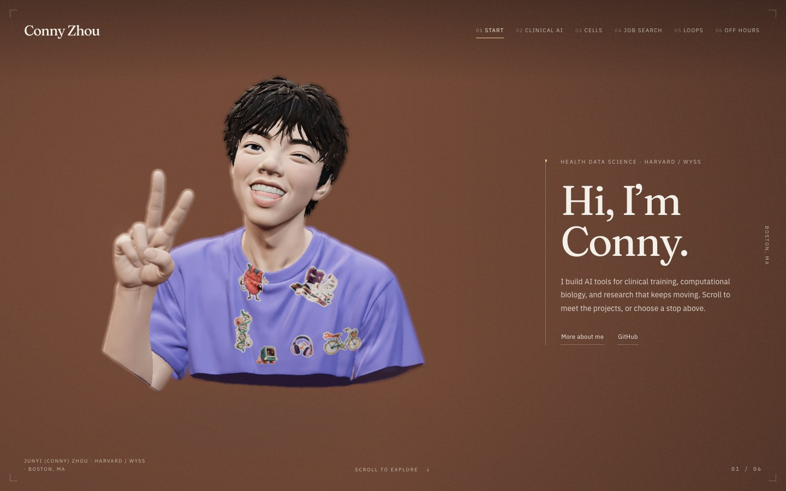

# Prepared character verification

The supplied wink, smile, peace sign, purple shirt, and color atlas remain in the prepared character. The new asset is integrated into the existing six-stop website. This report covers the local production build tested on September 16, 2026 in New York.

## Visual result

All six stops were inspected at 1440 × 900 and 390 × 844. A 390 × 568 view also passed the readable-content check. Portrait composition favors front and camera-right views because the supplied hand overlaps the mouth at left-oblique angles. The source model's capped torso and forearm remain visible from some angles.

The selected regional reduction preserves the face and hand better than the global 240,000-triangle trial in equivalent rendered crops. Smaller 40,000, 80,000, and 140,000-triangle candidates showed visible facial or finger faceting. The selected asset retains 179,975 triangles and the original 2048 × 2048 JPEG byte for byte.

## Checks

| Check | Result |
| --- | --- |
| `npm run verify` | Lint, TypeScript, and production build passed. |
| `scripts/verify/tour.mjs` | 32 checks passed, including six desktop and phone views, native partial scrolling, history, rapid retargeting, keyboard navigation, delayed resources, and static fallbacks. |
| `scripts/verify/decals.mjs` | Seven checks passed, including all six sticker interactions and a phone tap. |
| `scripts/verify/prepared-character.mjs` | 19 checks passed against the final build, including actual head deformation, fixed shirt and hand vertices, named materials, bounded pointer response, missing-Head fallback, and zero idle renders over nine seconds. |
| Asset reproduction | A second preparation and rig export produced the identical final GLB SHA-256. |
| Independent source review | No unresolved correctness findings. Redundant comments were removed. |

The 32 behavior checks and seven decal checks ran before the final conservative picking-bound expansion and missing-Head fallback. The 19 character checks ran after rebuilding those final changes. Comment and documentation edits followed the build.

## Timing observations

The strict timing suite did not pass every gate. The final three-run batch measured the following values at 1280 × 720, DPR 2, with the rendering surface capped at 1885 × 1060.

| Run | First camera response | Camera settled | 95th-percentile frame gap | Worst frame gap | Failed gate |
| --- | ---: | ---: | ---: | ---: | --- |
| 1 | 61.1 ms | 593.3 ms | 17.6 ms | 169.8 ms | Worst gap above 100 ms |
| 2 | 62.4 ms | 595.5 ms | 17.6 ms | 66.6 ms | None |
| 3 | 118.0 ms | 637.8 ms | 17.6 ms | 54.5 ms | Response above 100 ms |

All three runs had zero renders during each six-second idle observation, no retarget-state mismatch, no runtime errors, no post-load shader compilation, and no post-load asset texture uploads. Recovery from an injected 200 ms main-thread stall passed in every run. Small bone-pose texture updates during motion are counted separately from asset uploads.

An earlier batch measured responses of 194.6, 78.8, and 262.0 ms. A plain native-scroll control with no React or 3D measured 14.8, 91.7, and 120.9 ms from wheel event to its next animation callback. This establishes browser/host variability but does not explain all application delay. A separate instrumented tour run found synchronous navigation layout and history work before camera movement. Navigation bounds reads cost approximately 20–23 ms in two samples.

The remaining timing outliers are an open performance limitation. No threshold was relaxed and no wheel interception or continuous idle rendering was added. The [complete measured summaries](verification/prepared-character-motion.json) retain both acceptance batches and diagnostic comparisons. These times start at DOM event delivery and end at an animation callback; they do not measure physical input-to-display latency.

## Capability limits

The supplied face is connected geometry with painted eyes. This version has a real `Head` bone and bounded head response. It has no separate eyeballs, independent gaze, or blink animation. The user's explicit preference keeps the original wink and peace sign.

The desktop checks use Chrome with an Apple M1 GPU. Phone viewport checks verify responsive layout and touch behavior; they do not measure a physical phone's GPU or battery use. No production deployment or paid model generation ran.

## Reproduction

The [asset guide](prepared-character.md) contains the preparation commands, rig contract, and browser verification commands. Run timing checks separately from screenshot captures or builds.

Final GLB SHA-256 is `8643a1e0ed5e7b18789781c7270411b9eed43df7b72e406a5c4c42cf3d90f0ac`.
